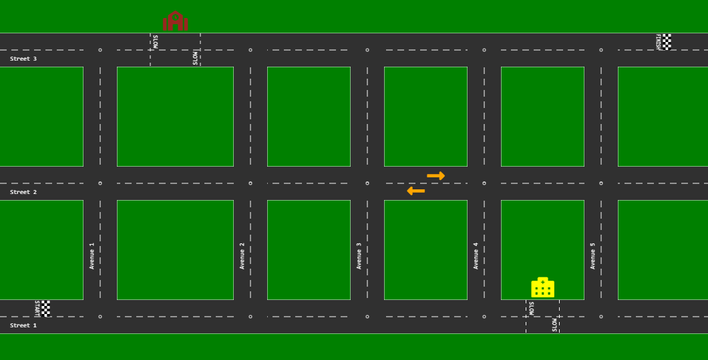

# Driverless Car

A small part of the town has been selected for testing of driverless vehicles. You will be in-charge of driving and keeping track of one of these vehicles.  

Your goal is to navigate and drive your car from start to finish, following traffic rules, in the least amount of time.  

There will be no other vehicles, pedestrians or obstacles on the roads. To navigate you need to give instructions to the vehicle. These instructions will be in the form of the direction, distance and acceleration/deceleration.

### Map Example

The picture below is a representation of the town area map (not to scale). Start and Finish are indicated.




## Semantics

### Rules
Standard traffic rules need to be followed at all times.
* Vehicles are driven on the left side of the road
* Vehicles need to maintain max speed allowed on the road or in that zone
* Vehicles can only move in the forward direction
* Vehicles are to be driven exactly in the middle of the lane
* Vehicles can't cross the road dividers
* Vehicles shouldn't slow down or stop at the finish line

#### Intersection Rules
* To take a turn, vehicle needs to be in the middle of the circular path that will turn
* Vehicles can pass through intersections at a **top speed of 5m/s**

Right turn at intersection  


Left turn at intersection  


### Location
Start and finish locations will be provided to you. Location is represented in co-ordinates (x, y) where x refers to the horizontal direction in meters and y refers to vertical direction in meters. Looking at the map example, x co-ordinate increases as you move from left to right, while y co-ordinate increases from bottom to top.
```json
{ "x": 100, "y": 100 }
```

### Roads
Roads are classified as streets and avenues. A road can be of type *street* or *avenue*. Streets run perpendicular to avenues. As seen on the map example, streets are horizontal and avenues are vertical.  
A road can have zones (which can restrict top speed). Roads have exactly one lane to go in each direction (splitting road width equally). Vehicles drive on the left side of the road. All **roads are 10 meters** wide and each **lane is 5 meters**. 
```json
{
  "name": "S1",
  "type": "street",
  "from": {
    "x": 0,
    "y": 100
  },
  "to": {
    "x": 500,
    "y": 100
  },
  "maxSpeed": 20,
  "zones": [
    {
      "maxSpeed": 10,
      "from": {
        "x": 250,
        "y": 100
      },
      "to": {
        "x": 300,
        "y": 100
      }
    }
  ]
}
```

### Vehicles
Vehicles have specifications like top speed, acceleration and deceleration (braking).
The vehicle can be assumed to be at the location where its front is (meaning you can ignore vehicle's length, consider it as a point).
```json
{
  "topSpeed": 25,
  "acceleration": 10,
  "deceleration": 15
}
```

### Instruction
Instruction to the vehicle includes direction, distance and acceleration/deceleration.
Acceleration should be +ve to increase speed, -ve to brake (decelerate), and zero to maintain speed.
Direction can be *straight*, *left*, or *right*. Distance should be **truncated to 3 decimal places** - for example, distance of 5.12395 meters should be sent as *5.123*.

```json
{
  "acceleration": 8,
  "distance": 5.925,
  "direction": "straight"
}
```

In order to turn, you would have to say something like *turn left for x meters at constant speed*. You would have to calculate the distance of the turn (remember to truncate to 3 decimal places).
```json
{
  "acceleration": 0,
  "distance": 1.234,
  "direction": "left"
}
```

### Units
* Location is specified in horizontal & vertical co-ordinates in m (meters)
* Speed is specified in m/s (meters per seconds)
* Acceleration is in m/s<sup>2</sup> (meters per second square)
* Deceleration is in m/s<sup>2</sup> (meters per second square)
* Distance is in m (meters)


### Sample Input

```json
{
  "gameId": "G495690bb",
  "roads": [
    {
      "name": "S1",
      "type": "street",
      "from": {
        "x": 0,
        "y": 100
      },
      "to": {
        "x": 5000,
        "y": 100
      },
      "maxSpeed": 20,
      "zones": [
      ]
    }
  ],
  "finish": {
    "x": 4800,
    "y": 102.5
  },
  "start": {
    "x": 0,
    "y": 102.5
  },
  "vehicle": {
    "acceleration": 10,
    "deceleration": 15,
    "topSpeed": 25
  }
}
```

### Sample Output

```json
{
  "gameId": "G495690bb",
  "instructions": [
    {
      "acceleration": 10,
      "distance": 20,
      "direction": "straight"
    },
    {
      "acceleration": 0,
      "distance": 4780,
      "direction": "straight"
    }
  ]
}
```

### How

* Expose a REST endpoint "driverless-car" that accepts HTTP POST request, for example *example.com/driverless-car*
* The endpoint will be called with input json, it should accept content-type *application/json*
* There will be 10 games presented to you
* You have 30 seconds to respond to each call
